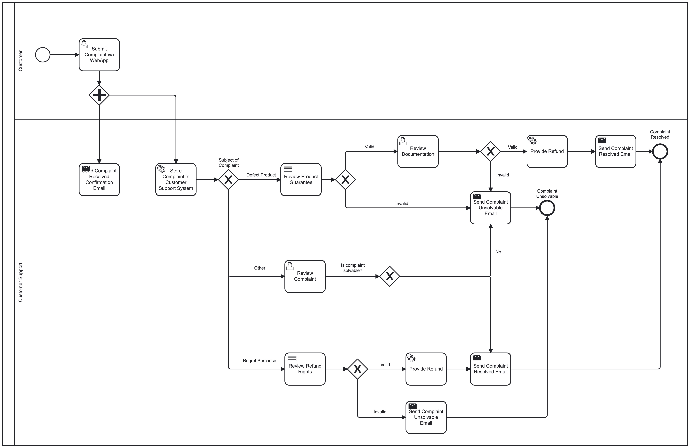

# System intergration - MP2 System Integration Mini Project 2 - Business Process Modelling and Automation
## Table of contents
- [Task requirements](#task-requirements)
  - [Objectives:](#Objectives)
  - [Tasks:](#Tasks)
  - [The solution:](#The-solution)
- [Step 1](#step-1)
  - [Folder structure:](#folder-structure)
- [Step 2](#step-2)
  - [Channels:](#Channels)
  - [Endpoints:](#Endpoints)
  - [Router:](#Router)
  - [Translator:](#Translator)
- [Step 3](#step-3)
- [Step 4](#step-4)
  - [BMPN](#BPMN)
# Task requirements
## Objectives
The main objective of this task is to help you get familiar with the business context of system integration and to provide practical experience in modelling and automation of business processes by implementation of standard notation and integration patterns.
## Tasks
The task is to design a business process and develop a software application workflow, which integrates and automates several disparate operations.
You can choose between processes related to either a) organization of customer activation, or
b) handling of customer complains
Requirements
The business process involves business rules, software services, and human tasks.
The model is defined in standard business process modelling notation (BPMN) and delivered in graphical
representation.
## The solution
Implements enterprise integration patterns (EIP) and good programming practices.
It is supplemented by a readme.md file, where the authors’ identification and the business scenario are introduced.
There is no requirement for using specific programming language for the application, but an automation platform, such as Camunda, Apache Camel, or an alternative must be implemented.
Presentation
A Github link to the project solution must be uploaded to Peergrade. Reviewing of other solutions will be required.
The successful completion of this assignment brings 20 credits (15 for a proper solution plus 5 for a proper feedback or self-evaluation).

# Step 1
## Folder structure:

📁service: 

📁resources: -> 📁BPMN -> 📁IMAGES

## Project Struture path

# Step 2

## Enterprise Integration Patterns (EIP) Implementation

Within this project, we've successfully integrated key Enterprise Integration Patterns (EIP) to enhance information exchange and automate various aspects of our business processes. EIP comprises a collection of design patterns tailored to address common integration challenges in enterprise applications. Here are the specific areas in which we've employed EIP principles:

## Channels

Implementation: We've harnessed email channels for communication purposes.
Description: Message channels have been instrumental in our communication strategy, particularly for reaching out to customers. These channels facilitate efficient communication with users and are a cornerstone of our business process automation.

## Endpoints

Implementation: We've designated email addresses as messaging endpoints.
Description: Email addresses serve as messaging endpoints in our project. Each email address functions as a unique destination for messages, enabling us to correspond with customers effectively. We use these endpoints to confirm complaint receipt, notify customers of resolutions, or inform them about unresolved complaints.

## Router

Implementation: We've incorporated branching logic to handle different email types (submission, resolved, unresolved).
Description: Message routing plays a vital role in our project by determining the appropriate email type to send based on the outcome of the complaint resolution process. This dynamic routing logic ensures that customers receive the right message, whether it's a submission confirmation, resolution notification, or an update on unresolved complaints.

## Translator

Implementation: We've applied message translation to convert text content into email messages.
Description: Our code includes message translation through the construction of email messages using StringBuilder. This translation process converts complaint details and resolution information into well-structured email body content, ready to be sent to the customer.
While our utilization of EIP is focused and context-specific, it showcases how these integration patterns can be effectively employed to streamline business processes and enhance communication with customers. These patterns play a pivotal role in orchestrating the exchange of information and automating key aspects of our operations.

# Step 3

## Interesting study objective

## Expected Solution

## Impact and beneficiaries

## Further development/improvements 

# Step 4
## BPMN

